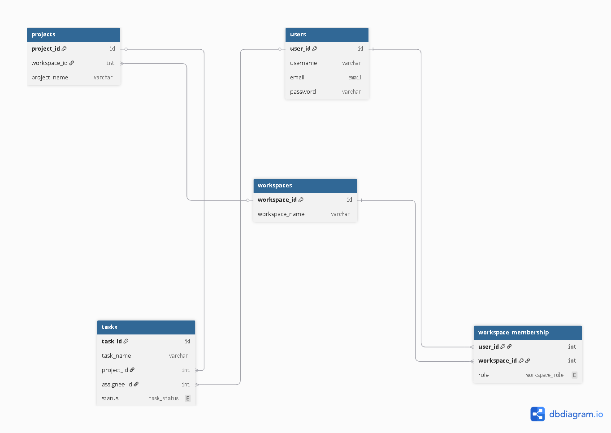

# Task Collaboration Application

## Overview
This application is a task collaboration system designed for teams to organize work, track progress, and collaborate within clearly defined roles. It is inspired by tools such as Jira and focuses on structured teamwork, accountability, and controlled task workflows.

Teams work inside shared spaces called **workspaces**, where projects and tasks are managed according to clearly defined responsibilities.

---

## How the Application Works

### Workspaces
- A workspace represents a team or organization.
- Each workspace has:
  - **One Owner**
  - **One or more Admins**
  - **Members**
- Workspaces define who can manage people, projects, and tasks.

### Roles & Responsibilities
Each user has a role **within a specific workspace**, and permissions depend on that role:

- **Owner**
  - Full control over the workspace
  - Manages members, projects, and tasks
- **Admin**
  - Assists in managing members, projects, and tasks
- **Member**
  - Works on assigned tasks
  - Can only update the status of tasks assigned to them

> A user may have different roles in different workspaces.

---

### Projects
- Each workspace can contain multiple projects.
- Projects are used to group related tasks and organize work logically.
- Projects inherit the workspace’s members and roles.

---

### Tasks
- Tasks represent individual units of work.
- Tasks can be assigned to members.
- Each task follows a defined lifecycle:
  - `To Do → Assigned → In Progress → Done`

---

### Task Rules & Workflow
The application enforces strict rules to ensure consistency and accountability:

- Once a task is marked as **Done**, it cannot be changed by anyone.
- Only Owners or Admins can move a task backward in its workflow.
- Members can only update tasks assigned to them.
- Members cannot modify tasks they do not own.

These rules ensure reliable task history and clear responsibility boundaries.

---

## Entity Relationship Diagram
The following diagram illustrates the main entities and their relationships within the system:

---

## API Documentation
The application exposes REST APIs for managing workspaces, projects, and tasks.

A complete API specification is available in OpenAPI format:

[View OpenAPI Specification](docs/openapi.yaml)

The OpenAPI file can be used with tools such as Swagger UI, Swagger Editor, or Postman to explore and test the APIs interactively.

---

## Key Goals
This project aims to:

- Enable effective team collaboration
- Enforce clear ownership and role boundaries
- Prevent unauthorized or inconsistent task changes
- Reflect real-world team workflows

---

## Intended Use
This project serves as:

- A portfolio project demonstrating backend system design
- A realistic task collaboration domain model
- A foundation that can be extended with additional features such as notifications, reporting, or integrations

---

## Status
This project is actively developed as a learning and portfolio project.
